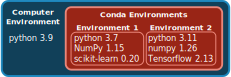

# Software Management [EXTRA]

## Using pre-installed software {#sec-module}

It is very often the case that HPC admins have pre-installed several software packages that are regularly used by their users. 
Because there can be a large number of packages (and often different versions of the same program), you need to load the programs you want to use in your script using the `module` tool. 

The following table summarises the most common commands for this tool:

| Command | Description |
| -: | :- |
| `module avail ` | List all available packages. |
| `module avail -a -i "pattern"` <br> or <br> `module avail 2>&1 | grep -i "pattern"` | Search the available package list that matches "pattern". Note the second option is given as some versions of `module` do not support case-insensitive search (`-i` option). |
| `module load <program>` | Load the program and make it available for use. |
| `module unload <program>` | Unload the program (removes it from your PATH). |


## The _Mamba_ package manager

Often you may want to use software packages that are not installed by default on the HPC.
There are several ways you could manage your own software installation, but in this course we will be using the **package manager _Mamba_**, which is a successor to another package manager called _Conda_.

_Conda_ and _Mamba_ are package managers commonly used in data science, scientific computing, and bioinformatics. 
_Conda_, originally developed by [Anaconda](https://anaconda.org/), is a package manager and environment manager that simplifies the creation, distribution, and management of software environments containing different packages and dependencies. 
It is known for its cross-platform compatibility and ease of use. 
**_Mamba_** is a more recent and high-performance alternative to _Conda_. 
While it maintains compatibility with Conda's package and environment management capabilities, _Mamba_ is designed for faster dependency resolution and installation, making it a better choice nowadays. 

One of the strengths of using _Mamba_ to manage your software is that you can have different versions of your software installed alongside each other, organised in **environments**. 
Organising software packages into environments is extremely useful, as it allows to have a _reproducible_ set of software versions that you can use and resuse in your projects. 

{#fig-conda}


To install mamba you can follow the instructions from a fresh install in the [mamba website](https://mamba.readthedocs.io/en/latest/installation/mamba-installation.html).

:::{.callout-note}
#### Mamba versus Module

Although _Mamba_ is a great tool to manage your own software installation, the disadvantage is that the software is not compiled specifically taking into account the hardware of the HPC. 
This is a slightly technical topic, but the main practical consequence is that software installed by HPC admins and made available through the `module` system may sometimes run faster than software installed via `mamba`. 
This means you will use fewer resources and your jobs will complete faster.
:::

## Containers

Containers are a technology that can be used to create and manage computational environments. 
A container is a lightweight, standalone executable package that contains everything needed to run a piece of software, including the operating system, libraries, and application code.
By using containers, researchers can ensure that their code runs consistently across different systems and platforms, without having to worry about dependencies or conflicts with other software on the host system.

For an HPC we recommend one of the most popular container platforms for cluster systems: _Singularity_. 
[Singularity](https://docs.sylabs.io/guides/3.5/user-guide/introduction.html) is a free and open-source computer program that performs operating-system-level virtualization also known as containerization. 
Singularity is also designed to create and manage isolated environments as [Docker](https://www.docker.com/), which is another popular and wildly used container platform (i.e. images created with docker can be compatible with Singularity and _vice versa_)*.

:::{.callout-note collapse=true}


#### Docker vs singularity

- Docker is well-suited for building and distributing software across different platforms and operating systems
- Singularity is specifically designed for use in HPC environments and can provide improved security and performance in those settings.
:::


### Singularity images

Although you can build your own Singularity images, for many popular software there are already pre-built images available from public repositories. 
Some popular ones are: 

- [depot.galaxyproject.org](https://depot.galaxyproject.org/singularity/)
- [Sylabs](https://cloud.sylabs.io/)

To download a software container from public repositories, use the `singularity pull` command as follows:

```bash
singularity pull my_seqkit_image.sif https://depot.galaxyproject.org/singularity/seqkit%3A2.8.0--h9ee0642_0
```

and then run it as:

```bash
singularity run my_seqkit_image.sif seqkit --help
```


## Summary

:::{.callout-tip}
#### Key Points

- The `module` tool can be used to search for and load pre-installed software packages on a HPC.
  - This tool may not always be available on your HPC.
- To install your own software, you can use the _Mamba_ package manager.
- Software containers can be a reliable alternative to _Mamba_ environments, with many pre-existing containers available at [Sylabs](https://cloud.sylabs.io/) and [depot.galaxyproject.org](https://depot.galaxyproject.org/singularity/).
- To download a software container from public repositories, use the `singularity pull` command.
- To run a command within the software container, use the `singularity run` command.

Further resources:

- Search for _Mamba_ packages at [anaconda.org](https://anaconda.org).
- Learn more about _Conda_ from the [Conda User Guide](https://docs.conda.io/projects/conda/en/latest/user-guide/).
- [Conda Cheatsheet](https://docs.conda.io/projects/conda/en/latest/user-guide/cheatsheet.html) (PDF).
:::
