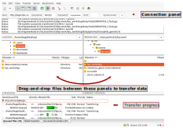

:::{.callout-tip}
#### Learning Objectives

- Move files in and out of the HPC storage using _Filezilla_ or `rsync`/`scp`. 
:::


## Moving Files

There are several options to move data between your local computer and a remote server.
We will cover three possibilities in this section, which vary in their ease of use.

A quick summary of these tools is given in the table below. 

| | Filezilla | SCP | Rsync |
| :-: | :-: | :-: | :-: |
| Interface | GUI | Command Line | Command Line |
| Data synchronisation | yes | no | yes |


### Filezilla (GUI)

This program has a graphical interface, for those that prefer it and its use is relatively intuitive.

To connect to the remote server (see Figure 3): 

1. Fill in the following information on the top panel:
  - Host: train.bio
  - Username: your HPC username
  - Password: your HPC password
  - Port: 22
1. Click "Quickconnect" and the files on your "home" should appear in a panel on right side.
1. Navigate to your desired location by either clicking on the folder browser or typing the directory path in the box "Remote site:".
1. You can then drag-and-drop files between the left side panel (your local filesystem) and the right side panel (the HPC filesystem), or vice-versa.




### `scp` (command line)

This is a command line tool that can be used to copy files between two servers.
One thing to note is that it always transfers all the files in a folder, regardless of whether they have changed or not.

The syntax is as follows:

```bash
# copy files from the local computer to the HPC
scp -r path/to/source_folder <user>@train.bio:path/to/target_folder

# copy files from the HPC to a local directory
scp -r <user>@train.bio:path/to/source_folder path/to/target_folder
```

The option `-r` ensures that all sub-directories are copied (instead of just files, which is the default).


### `rsync` (command line)

This program is more advanced than `scp` and has options to synchronise files between two directories in multiple ways. 
The cost of its flexibility is that it can be a little harder to use. 

The most common usage is:

```bash
# copy files from the local computer to the HPC
rsync -auvh --progress path/to/source_folder <user>@train.bio:path/to/target_folder

# copy files from the HPC to a local directory
rsync -auvh --progress <user>@train.bio:path/to/source_folder path/to/target_folder
```

- the options `-au` ensure that only files that have changed _and_ are newer on the source folder are transferred
- the options `-vh` give detailed information about the transfer and human-readable file sizes
- the option `--progress` shows the progress of each file being transferred

:::{.callout-warning}

When you specify the *source* directory as `path/to/source_folder/` (with `/` at the end) or `path/to/source_folder` (without `/` at the end), `rsync` will do different things:

- `path/to/source_folder/` will copy the files *within* `source_folder` but not the folder itself
- `path/to/source_folder` will copy the actual `source_folder` as well as all the files within it
:::

:::{.callout-tip}
To check what files `rsync` would transfer but not actually transfer them, add the `--dry-run` option. This is useful to check that you've specified the right source and target directories and options.
:::

<!-- 
## Exercises

:::{.callout-exercise}

**Note:** only do this exercise if you are following the materials by yourself as a self-learner. For those attending our live workshop we already put the materials on the training HPC.

- <a href="https://www.dropbox.com/sh/mcu1hjxlr8yqxxa/AAB8s5NcHZH1Tkof4B5JXuyLa?dl=0" target="_blank" rel="noopener noreferrer">Download the data</a> for this course to your computer and place it on your Desktop. (do not unzip the file yet!)
- Use _Filezilla_, `scp` or `rsync` (your choice) to move this file to the directory we created earlier: `/home/USERNAME/rds/hpc-work/hpc_workshop/`. 
- The file we just downloaded is a compressed file. From the HPC terminal, use `unzip` to decompress the file.
- Bonus: how many shell scripts (files with `.sh` extension) are there in your project folder? 

:::{.callout-answer}

Once we download the data to our computer, we can transfer it using either of the suggested programs. 
We show the solution using command-line tools.

Notice that these commands are **run from your local terminal**:

```bash
# with scp
scp -r ~/Desktop/hpc_workshop_files.zip username@train.bio:rds/hpc-work/hpc_workshop/

# with rsync
rsync -avhu ~/Desktop/hpc_workshop_files.zip username@train.bio:rds/hpc-work/hpc_workshop/
```

Once we finish transfering the files we can go ahead and decompress the data folder. 
Note, this is now run **from the HPC terminal**:

```bash
# make sure to be in the correct directory
cd ~/rds/hpc-work/hpc_workshop/

# decompress the files
unzip hpc_workshop_files.zip
```

Finally, we can check how many shell scripts there are using the `find` program and piping it to the `wc` (word/line count) program:

`find -type f -name "*.sh" | wc -l`

`find` is a very useful tool to find files, check this [Find cheatsheet](https://devhints.io/find) to learn more about it.

:::
::: 
-->


## Summary

:::{.callout-tip}
#### Key Points

- To transfer files to/from the HPC we can use _Filezilla_, which offers a user-friendly interface to synchronise files between your local computer and a remote server.
  - Transfering files can also be done from the command line, using tools such as `scp` and `rsync` (this is the most flexible tool but also more advanced). 
:::